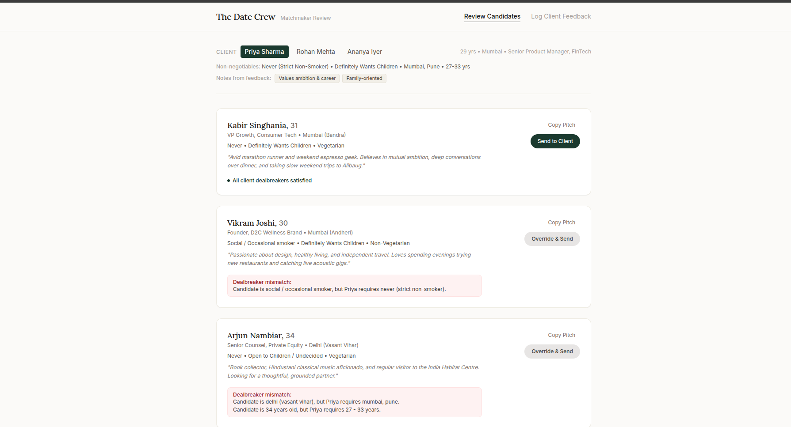
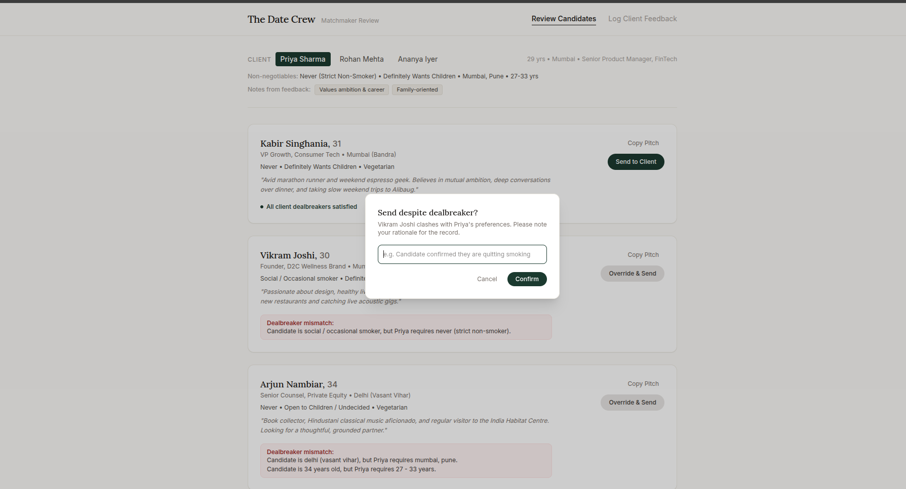
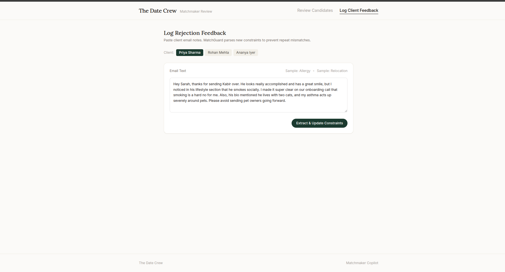

# The Date Crew - Product & Tech Generalist Assessment

Written Assessment (Google Doc): https://docs.google.com/document/d/1fSbqK0h9bGQ9Afgm4adVDoSbfdkG3L1QYVjcYDM_2dE/edit?usp=sharing

---

## The Problem

35% of client rejections at The Date Crew happen because matchmakers recommend profiles that violate non-negotiable client preferences (smoking, children, location, age) that clients already specified on day one. Matchmakers also spend roughly 2 hours per client each week manually searching for profiles.

## The Solution: MatchGuard

MatchGuard is an internal pre-flight screening tool for matchmakers:
- Checks candidate profiles against hard client dealbreakers before matchmakers hit send.
- Warns matchmakers about explicit clashes and requires an override note to send non-compliant profiles.
- Generates quick email pitch bullet points for compliant profiles.
- Parses unstructured client email rejection replies into structured constraints to avoid repeating mistakes.

---

## Prototype Screenshots

### 1. Pre-Flight Screening & Dealbreaker Detection
Checks candidate profiles against non-negotiable client preferences before sending.



### 2. Dealbreaker Override Guardrail
Requires matchmakers to document an explicit rationale if overriding a client dealbreaker.



### 3. Unstructured Feedback Parser
Extracts structured constraint tags from free-text client rejection emails.



---

## Quick Start

```bash
# Install dependencies
npm --prefix prototype install

# Start local server
npm run dev
```

Open http://localhost:5173 in your browser.
